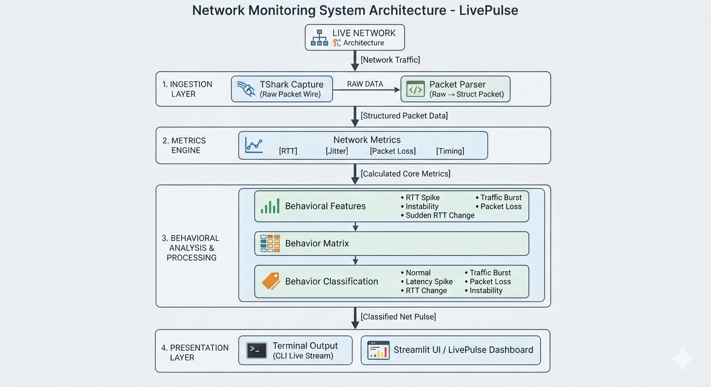
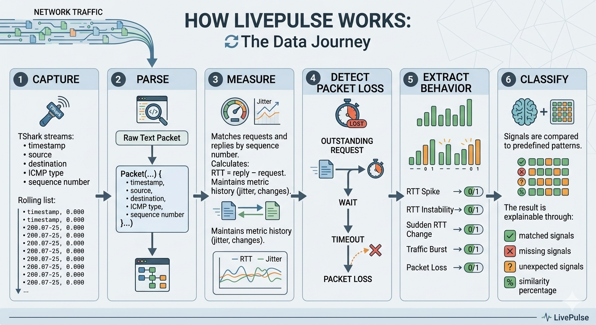

📡 LivePulse

Real-time network behavior monitoring from live packet traffic.

LivePulse is a V1 network-monitoring project that converts raw ICMP traffic into measurable and explainable network behavior.

It captures packets with TShark, parses them into structured data, calculates network metrics, extracts behavioral signals, compares them against a behavior matrix, and presents the results through a terminal monitor and Streamlit dashboard.

🎯 Problem

Normal ping output mainly answers:

Did the host reply?

How long did it take?

LivePulse goes one step further by describing how the network is behaving using signals such as:

RTT spikes

RTT instability

sudden RTT changes

traffic bursts

packet loss

Problem statement

How can live network traffic be transformed into measurable, interpretable network behavior in real time?

🏗️ Architecture

Component responsibilities

Component

Responsibility

capture.py

Captures live ICMP traffic using TShark

parser.py

Converts raw TShark output into Packet objects

metrics.py

Calculates RTT, jitter, loss and behavioral signals

monitor.py

Coordinates the pipeline and terminal output

dashboard.py

Visualizes live network behavior

main.py

Starts LivePulse

🔄 How It Works

1. Capture

TShark streams:

timestamp
source
destination
ICMP type
sequence number

2. Parse

Raw text becomes a structured packet:

raw packet
    ↓
Packet(...)

3. Measure

LivePulse matches ICMP requests and replies using their sequence numbers.

RTT = reply timestamp - request timestamp

It also maintains recent history to calculate jitter and detect changes.

4. Detect packet loss

Outstanding requests are tracked.

If a reply does not arrive within the configured timeout:

REQUEST
   ↓
WAIT
   ↓
TIMEOUT
   ↓
PACKET LOSS

5. Extract behavior

Measurements become simple behavioral signals:

RTT Spike          → 0 / 1
RTT Instability    → 0 / 1
Sudden RTT Change  → 0 / 1
Traffic Burst      → 0 / 1
Packet Loss        → 0 / 1

6. Classify

The signals are compared against predefined behavior patterns.

The result is explainable through:

matched signals

missing signals

unexpected signals

similarity percentage

🧠 Important Engineering Decisions

Current observation is not used to build its own baseline

The order is:

Previous history
      ↓
Analyze current observation
      ↓
Classify behavior
      ↓
Store current observation

This prevents the current RTT from influencing the baseline used to judge itself.

Request/reply correlation

RTT is calculated using ICMP sequence numbers rather than assuming packets arrive perfectly in order.

Explainable behavior

Instead of simply saying:

Anomaly

LivePulse can explain:

Possible Network Instability

Matched:
- RTT Spike
- Sudden RTT Change

Missing:
- RTT Instability

📊 Dashboard

The Streamlit dashboard provides:

Average RTT

Jitter

Packet loss

Live RTT chart

Current behavior

Behavioral signals

Recent behavior timeline

🖥️ Run

1. Activate environment

.venv\Scripts\Activate.ps1

2. Start LivePulse terminal monitor

python main.py

3. Generate traffic

In another terminal:

ping -n 30 8.8.8.8

4. Start dashboard

streamlit run dashboard.py

Streamlit will display a local URL in the terminal. Open that URL in your browser.

📁 Project Structure

livepulse/
│
├── livepulse/
│   ├── __init__.py
│   ├── capture.py
│   ├── parser.py
│   ├── metrics.py
│   └── monitor.py
│
├── dashboard.py
├── main.py
├── requirements.txt
├── .gitignore
└── README.md

🧪 V1 Scope

LivePulse V1 is a lightweight, rule-based network behavior monitoring system focused on live ICMP traffic.

It is designed to be:

real-time

explainable

modular

lightweight

easy to inspect and extend

LivePulse turns raw network traffic into an interpretable view of network behavior.